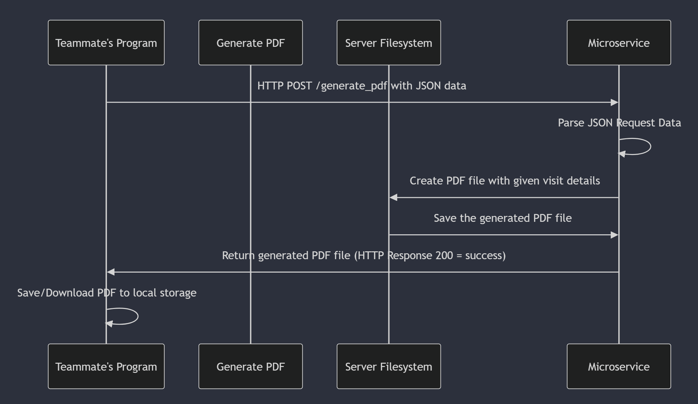

Microservice A: Turns information from a vet visit into a downloadable pdf file

Description

This microservice recieves a request from the main program including data about a pets vet visit. This data is in JSON format. The microservice reads this data and tranfers it to a formatted pdf file. Finally, the generated pdf file is sent back as a downloadable file.

How to programmatically REQUEST data from the microservice:

To request a PDF to be generated, send a POST request with JSON-formatted data as shown below.  

All together, this is what your python code should look like in order to send a request to this microservice: 

    import requests

    test_data = {
        "name": "Charlie",
        "date_of_visit": "2025-02-25",
        "vet_clinic": "Corvallis Veterinary Hostpital",
        "vet_name": "Dr. Murphy",
        "description": "Routine check-up and vaccination appointment",
        "medication": "Administered rabies vaccine"
    }

    response = requests.post("http://localhost:8080/generate_pdf", json=data)

How to programmatically RECIEVE data from the microservice:

    if response.status_code == 200:
        pdf_filename = f"{data['name']}_visit_information.pdf"
        with open(pdf_filename, "wb") as file:
            file.write(response.content)
        print(f"PDF was successfully received and saved as {pdf_filename}")
    else:
        print(f"Failed to generate a PDF. Error {response.status_code}: {response.text}")

UML Sequence Diagram:

